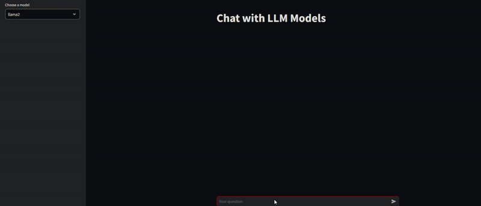
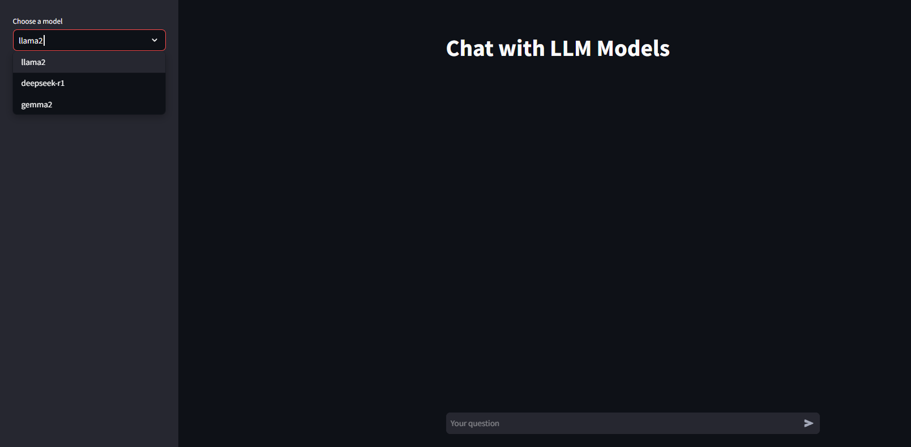

# 🧠 Chat with LLM Models - Streamlit App

Welcome to the **Chat with LLM Models** app! This interactive Streamlit application allows you to chat with powerful Large Language Models (LLMs) such as **llama2** and **deepseek-r1** in real-time. It’s designed to offer seamless conversations with AI, complete with model response streaming and performance tracking.

  

  

## 🚀 Features

- **Real-time Chat**: Engage in live conversations with the selected LLM model.
- **Model Selection**: Choose between three cutting-edge models (**llama2**, **deepseek-r1**,**gemma-2**) via a simple sidebar.
- **Response Streaming**: Get responses streamed as they are generated, so you see the AI's thought process in real-time.
- **Performance Tracking**: Display response times for each interaction.
- **Error Handling**: Graceful error handling with helpful messages for troubleshooting.
- **Logging**: Every user input, model response, and error is logged for transparency and debugging.

## 📦 Prerequisites

Before running the app, ensure you have the following installed:

- Python 3.8+
- Streamlit
- llama_index (for interacting with the models)
- ollama (for model access)

### Install Dependencies

To install the necessary dependencies, run the following:

pip install streamlit llama_index ollama
##⚡ How to Run

Clone or Download the Repository
Clone the repo using Git:

bash
Copy
Edit
git clone [https://github.com/yourusername/chat-with-llm-models.git](https://github.com/JIKS31/LLM.git)
Or download the ZIP and extract it to your local machine.

Install Dependencies
Install the necessary Python libraries by running:

bash
Copy
Edit
pip install -r requirements.txt
Run the App
Start the Streamlit app with the following command:

bash
Copy
Edit
streamlit run app.py
Access the App
Once the app is running, open your web browser and go to http://localhost:8501 to interact with the app.

Choose a Model
Use the sidebar to select a model (llama2 or deepseek-r1) and start chatting!

✨ How It Works
Sidebar Model Selection: Choose your desired model from the dropdown menu.
User Input: Enter your prompt in the chat input box.
Live Response Streaming: As the model generates a response, you’ll see it stream live, letter by letter.
Response Duration: The app displays how long it took the model to generate the response, so you can track performance.
💻 Example Interaction
User: "What's the capital of Japan?"
Assistant: "The capital of Japan is Tokyo."
Duration: The response time is displayed (e.g., Duration: 2.34 seconds).

📚 Logs & Error Handling
Logs are automatically created for every user input, model response, and any errors that may occur. The app handles errors gracefully, providing useful messages if something goes wrong.

🌐 Live Demo
Try it out yourself! You can deploy this app to a platform like Streamlit Cloud or any other cloud hosting service to make it available for everyone.

🤝 Contributing
We welcome contributions! If you want to improve the app or add features, feel free to fork the repository and submit a pull request. Please follow the standard contribution guidelines:

Fork the repo
Create a new branch
Make your changes
Create a pull request
📜 License
This project is licensed under the MIT License - see the LICENSE file for details.

🎉 Enjoy your chat with LLM models!
